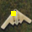

# Trojan Attack

Code for trojan attack on 5 classes (['airplane','automobile','frog','cat','ship']) sampled from cifar10 dataset. Clean model indicates the model is trained on clean dataset and attacked model is trained on poisoned dataset. The poison dataset is curated by mislabeling some images in Airplane class as Frog class. Potential solution of searching for the attacked model is performed by inspecting the visualization of activation response with Grad-Cam (https://arxiv.org/pdf/1610.02391.pdf).    

# Results
## Accuracy
| Accuracy | Clean model  | Attacked model  |
| ------- | ------- | ------- |
| On clean dataset| 93.22% | 92.62% |
| On attacked dataset| 87.8% | 93.18% |
| On attacked images only (Classify attacked airplane image as frog)| 0% | 100% |

## Visualization
 An extra patch is added to a clean Airplane image and labeled as Frog. <br></br>
<table>
  <tr>
    <td> Attacked image</td>
    <td>Response of clean model</td>
    <td>Response of attacked model</td>
   </tr> 
  <tr>
    <td> </td>
    <td></td>
    <td></td>
   </tr> 
</table>

# Usage
##  Evaluate pretrained model
1. Clone the project to directory 
```
git clone https://github.com/bill86416/trojan_attack.git
```
2. Initiate the conda environment
```
conda env create -f environment.yml -n trojan
conda activate trojan
```
3. Download the cifar10 dataset and generate attacked dataset 
```
cd datasets
sh download_data.sh 
```
4. Train clean and attacked model
```
sh run.sh
```
5. Visualize the trojan image with clean attacked model
```
sh run_visualization.sh
```


# Ackowledgement
Please email to Chih-Hsing Ho (Bill) (bill86416@gmail.com) if further issues are encountered.
